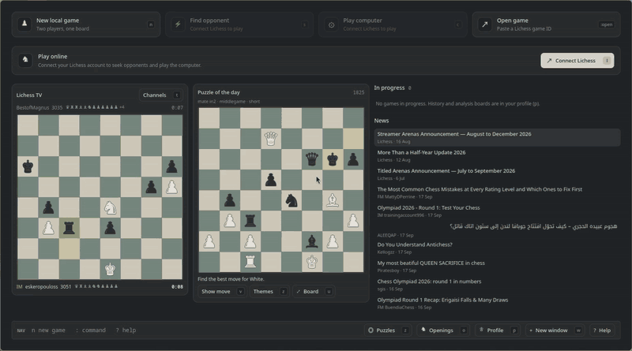
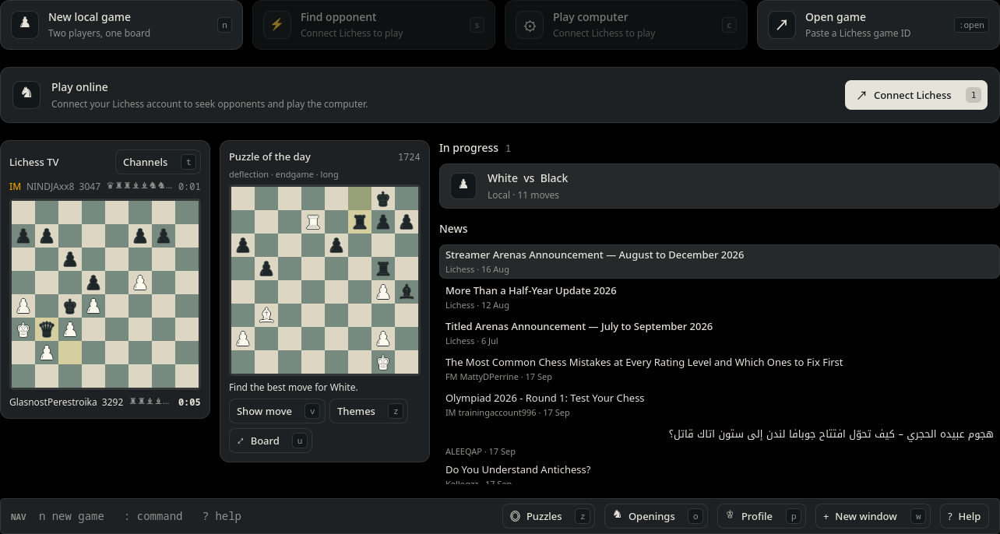
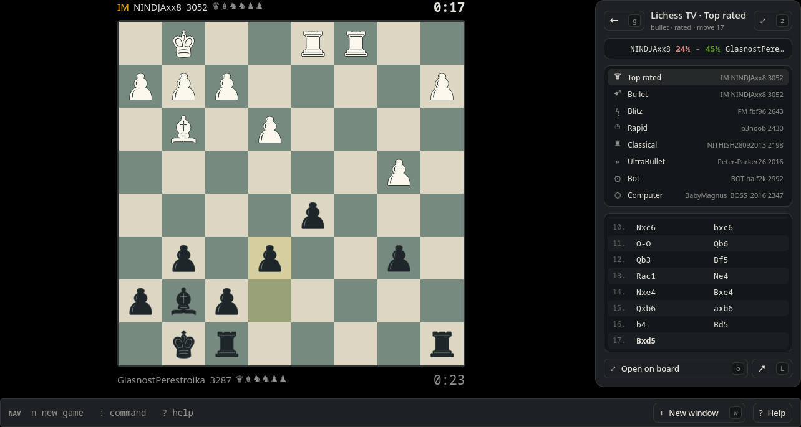
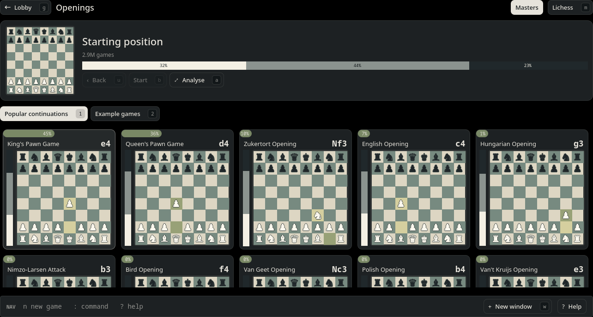
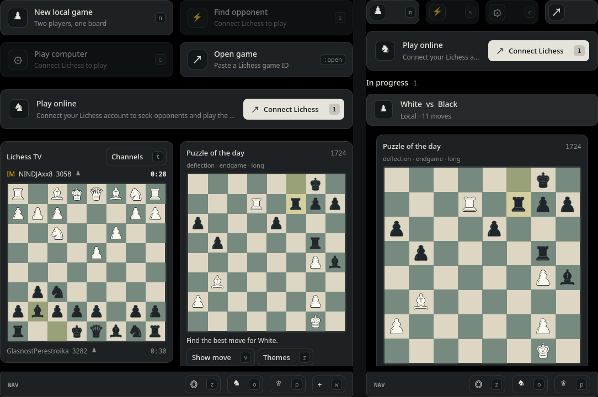

<div align="center">

# ♞ Gambito

**A keyboard-first Lichess client for tiling desktops.**
Rust daemon · Qt Quick UI · Stockfish analysis

[Install](docs/install.md) · [Guide](docs/guide.md) · [Keyboard](docs/keyboard.md) · [CLI & protocol](docs/cli.md) · [Development](docs/development.md)



</div>

Gambito brings Lichess to your desktop the way the rest of your setup already works: every action has a key, windows tile cleanly at any size, and the UI is a standalone Qt Quick application. A small Rust daemon holds the games, streams from Lichess and runs Stockfish, so any number of windows (or scripts) can share the same game.

## Why Gambito

- **Keyboard first, mouse optional.** `hjkl` or SAN/UCI to move, `:` for a command line, `?` for every key. Every button shows its key.
- **Made for tiling.** Every page reflows from a full screen down to a narrow column, and scrolls instead of clipping; zen mode (`z`) shows just the board.
- **Standalone Qt.** Runs as a normal Linux desktop application, with desktop entries, window classes and Qt packaging.
- **Your theme, live.** Follows Omarchy and desktop `colors.toml` files out of the box, and accepts palettes generated by matugen, pywal or your own script.
- **A daemon like `emacs --daemon`.** `gambito open` attaches a window; closing it keeps your games, clocks and streams running. Open the same game in two windows, or drive it from the CLI.
- **Real analysis.** Local Stockfish up to depth 245 with live updates and a best-move arrow, Lichess server analysis with `?!` `?` `??` marks, opening explorer, and analysis boards with saved variations.
- **Fair play built in.** Engine, explorer and analysis are blocked by the daemon in your own live games.

## Features

| Play | Study | Watch |
|---|---|---|
| Seek opponents (Rapid, Classical, correspondence) | Stockfish evaluation with depth control | Lichess TV and tournament broadcasts |
| Lichess AI levels 1–8 | Lichess computer analysis per move | Open any TV game on your own board |
| Challenges, chat and takebacks | Opening explorer (Masters and Lichess) | Profile: ratings chart, history, accuracy |
| Local two-player games | Puzzle of the day and every puzzle theme | News from the Lichess blog |
| Desktop notifications | Analysis boards from any position or FEN | PGN export, NDJSON event stream |

<table>
<tr>
<td width="50%"></td>
<td width="50%"></td>
</tr>
<tr>
<td width="50%"></td>
<td width="50%"></td>
</tr>
</table>

## Quick start

On Arch Linux (including Omarchy):

```sh
sudo pacman -S --needed rust cmake qt6-base qt6-declarative stockfish ttf-dejavu libnotify
git clone https://github.com/harbefas/gambito && cd gambito
cargo build --release
cmake -S standalone -B target/qt-build -DCMAKE_BUILD_TYPE=Release
cmake --build target/qt-build -j2
cmake --install target/qt-build --prefix "$HOME/.local"
./target/release/gambito open
```

`gambito open` starts the daemon when needed and opens the lobby. Press **Connect Lichess** (`l`) to sign in through your browser; local games, TV, puzzles and news work without an account. To install it for your user (systemd service, launcher entry, Omarchy or Hyprland keybinding, theme), see [Install](docs/install.md).

Published builds can be installed with `./scripts/install.sh` and updated later with `gambito update`; source checkouts can continue using `git pull` and `cargo build --release`.

## Keys you'll use first

| Key | Action | Key | Action |
|---|---|---|---|
| `s` / `c` | Find opponent / play computer | `e` | Engine on/off |
| `hjkl` + Enter | Move a piece | `i` | Type a move (`Nf3`, `e2e4`) |
| `[` `]` | Step through moves | `a` | Analysis board from here |
| `t` / `o` / `z` / `p` | TV / openings / puzzles / profile | `z` (on a board) | Zen mode |
| `d` | Study library | `S` (finished game) | Save for study |
| Backspace | Back one level | Esc | Cancel |
| Home / End | Start / live position | Enter | Open / activate |
| `w` | New window | `?` | All keys |

Full list: [docs/keyboard.md](docs/keyboard.md).

## From the terminal

```sh
gambito seek 15 10 --rated           # find an opponent
gambito move ABCDef12 Nf3            # play in any game
gambito challenge Friend --days 3    # correspondence challenge
gambito --json watch | jq .          # every state change as NDJSON
```

Windows and scripts talk to the same daemon over a Unix socket with one JSON object per line. See [CLI & protocol](docs/cli.md).

## Status

Gambito is young and developed on Hyprland. Standard chess only (no variants or premoves), and Bullet/Blitz seeks are hidden because Lichess does not pair third-party apps in those pools. [Known limitations](docs/development.md#current-limitations).

Gambito is not affiliated with Lichess. It uses the public [Lichess API](https://lichess.org/api) and draws pieces with system font glyphs; no Lichess assets are copied.

## Contributing

Bug reports and small fixes are welcome: see [CONTRIBUTING.md](CONTRIBUTING.md). Never paste a Lichess token into an issue.

## License

[GPL-3.0-or-later](LICENSE).
